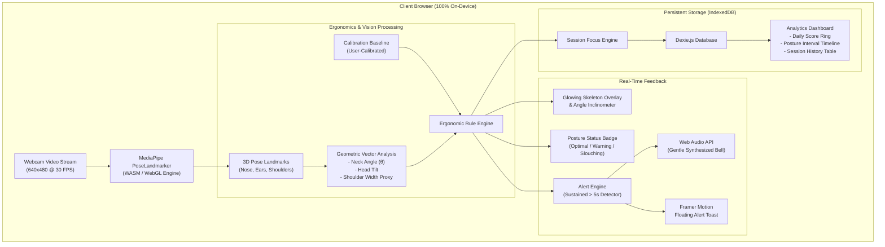

# PostureLens 👁️⚡

> **Real-Time On-Device AI Posture & Ergonomics Health Monitor for Developers**  
> 100% Client-Side Privacy • Low Latency WebAssembly/WebGL • Dexie.js IndexedDB • Web Audio API

---

## 💡 Overview

Modern software development and remote desk work often lead to prolonged slouching, forward head posture ("tech neck"), and severe eye strain from leaning too close to displays. 

**PostureLens** is a modern, privacy-first web application designed specifically for developers and engineers. It uses MediaPipe Pose detection directly inside the browser to continuously evaluate spinal alignment, neck inclination, and screen proximity in real time.

When poor posture is sustained for more than 5 seconds, PostureLens delivers a gentle synthesized audio chime and an unobtrusive floating notification. All session metrics and posture intervals are saved directly into your browser's persistent IndexedDB storage, generating rich historical ergonomic analytics without a single frame of video ever leaving your device.

---

## ✨ Key Features

- 🔒 **100% On-Device & Zero Video Upload:** Inference runs completely inside browser WebAssembly and WebGL via `@mediapipe/tasks-vision`. No video feeds, images, or telemetry are ever uploaded or transmitted over the network.
- 📐 **Ergonomic Geometry Engine:** Computes real-time 3D neck inclination angles ($\theta_{\text{neck}}$), forward chin tilt, shoulder symmetry, and screen proximity ratios.
- 🎯 **3-Second Baseline Calibration:** Personalized calibration button establishes your natural, optimal upright posture baseline.
- ⏱️ **Focus Session Controller:** Start, pause, resume, and end monitored desk sessions with live time-in-posture tracking.
- 🔔 **Gentle Sound & Visual Alerts:** Pure Web Audio API synthesized harmonic chimes (no audio file downloads required) and smooth Framer Motion floating notifications for sustained slouching (>5s).
- 💾 **Persistent Client-Side Database:** Built on Dexie.js (IndexedDB) to persist session history, interval logs, and user calibration across restarts.
- 📊 **Ergonomics Analytics Dashboard:** Daily posture score ring, interactive interval timeline chart, incident counters, and JSON export capabilities.
- 🌌 **Cyberpunk / Minimalist Dark UI:** Sleek slate/zinc dark aesthetic with glowing joint vectors, customizable skeleton overlays, and responsive design.

---

## 🏗️ System Architecture



---

## 🔒 Privacy Model

Unlike traditional health monitors or cloud-connected webcam utilities:
- **Zero Server Telemetry:** The video stream is piped directly from `navigator.mediaDevices.getUserMedia()` to an HTML5 `<video>` element, directly read by the MediaPipe WASM binary.
- **Local Storage Only:** Calibration baselines, session durations, and posture sample scores are written strictly to browser IndexedDB (`PostureLensDB`).
- **Offline Capable:** The MediaPipe Pose model (`pose_landmarker_lite.task`) is bundled locally in `/public/models/`, allowing the application to execute fully offline.

---

## 🧮 Ergonomic Angle Formulations

### 1. Neck Inclination Angle ($\theta_{\text{neck}}$)
Calculated from the vector between the shoulder midpoint ($\mathbf{M}_{\text{shoulder}}$) and ear midpoint ($\mathbf{M}_{\text{ear}}$):

$$\mathbf{M}_{\text{shoulder}} = \left( \frac{x_{\text{LS}} + x_{\text{RS}}}{2}, \frac{y_{\text{LS}} + y_{\text{RS}}}{2}, \frac{z_{\text{LS}} + z_{\text{RS}}}{2} \right)$$

$$\mathbf{M}_{\text{ear}} = \left( \frac{x_{\text{LE}} + x_{\text{RE}}}{2}, \frac{y_{\text{LE}} + y_{\text{RE}}}{2}, \frac{z_{\text{LE}} + z_{\text{RE}}}{2} \right)$$

$$\Delta x = |x_{\mathbf{M}_{\text{ear}}} - x_{\mathbf{M}_{\text{shoulder}}}|, \quad \Delta y = y_{\mathbf{M}_{\text{shoulder}}} - y_{\mathbf{M}_{\text{ear}}}$$

$$\theta_{\text{neck}} = \arctan\left(\frac{\Delta x}{\Delta y}\right) \times \frac{180}{\pi}$$

### 2. Screen Distance Proxy ($D_{\text{proxy}}$)
Calculated from normalized shoulder clavicle width in the 2D plane:

$$W_{\text{shoulder}} = \sqrt{(x_{\text{RS}} - x_{\text{LS}})^2 + (y_{\text{RS}} - y_{\text{LS}})^2}$$

$$D_{\text{proxy}} = \frac{W_{\text{shoulder}}}{W_{\text{baseline}}}$$

- **Too Close Warning:** $D_{\text{proxy}} > 1.35$
- **Too Far Warning:** $D_{\text{proxy}} < 0.65$

### 3. Slouching Detection Condition
A slouch is flagged when either:
1. Neck inclination exceeds baseline by $+14^\circ$:  
   $$\theta_{\text{neck}} - \theta_{\text{baseline}} > 14^\circ$$
2. Vertical head drop exceeds $18\%$ of baseline nose-shoulder distance:  
   $$\frac{\Delta y_{\text{baseline}} - \Delta y_{\text{current}}}{\Delta y_{\text{baseline}}} > 0.18$$

If this condition persists continuously for **$\ge 5$ seconds**, the alert engine triggers an audible chime and a floating visual toast.

---

## 🚀 Getting Started

### Prerequisites
- Node.js 18.17+ or 20+
- npm or yarn

### Installation

```bash
# Clone repository
git clone https://github.com/your-username/posturelens.git
cd posturelens

# Install dependencies
npm install

# Start local development server
npm run dev
```

Open [http://localhost:3000](http://localhost:3000) in Chrome, Edge, Safari, or Firefox.

### Building for Production

```bash
npm run build
npm run start
```

---

## 🎬 Demo GIF & Recording Instructions

To create a clean demo GIF or video walkthrough for showcase:

1. **Setup Recording Tool:**
   - Use [CleanShot X](https://cleanshot.com/), [Kap](https://getkap.co/), or macOS native QuickTime (`Cmd + Shift + 5`).
   - Set recording area to `1280x720` or browser window frame.
2. **Demonstration Flow:**
   - **Step 1 (Start Up):** Open `http://localhost:3000`, grant camera permissions, notice immediate WASM initialization and green skeleton tracking.
   - **Step 2 (Calibration):** Click **Calibrate Baseline**, sit upright with optimal posture, and watch the 3-second countdown complete.
   - **Step 3 (Focus Session):** Click **Start Focus Session**. Notice the live timer and upright ratio incrementing.
   - **Step 4 (Slouch Trigger):** Intentionally drop head forward or slouch for >5 seconds. Watch the status change to 🔴 *Poor Posture*, the gentle chime chime sound, and the floating toast appear.
   - **Step 5 (Correction):** Sit back upright; observe the green *Posture Restored!* toast.
   - **Step 6 (Analytics Dashboard):** Click **End & Save** (confetti triggers for scores $\ge 80\%$), then click **Analytics** in the navbar to view the daily score ring and timeline chart.
3. **Save as GIF:**
   - Export at 30 FPS, optimized palette (under 15MB) for optimal GitHub README rendering.

---

## 🛠️ Tech Stack Breakdown

| Layer | Technology | Purpose |
| :--- | :--- | :--- |
| **Framework** | Next.js 14+ (App Router) | High-performance React framework |
| **Language** | TypeScript (Strict mode) | Type safety across vision & DB schemas |
| **Styling** | Tailwind CSS | Dark mode cyberpunk / minimalist aesthetics |
| **AI Vision** | `@mediapipe/tasks-vision` | On-device 3D PoseLandmarker via WebAssembly |
| **Animations** | Framer Motion | Floating alerts, smooth status transitions |
| **Sound Synthesis**| Web Audio API | Pure synthesized harmonic chime alerts |
| **Client Database**| Dexie.js (IndexedDB) | Persistent session & posture sample logs |
| **Icons** | Lucide React | Modern icons for ergonomic telemetry |

---

## 📄 License
MIT License. Built with privacy and developer health in mind.
